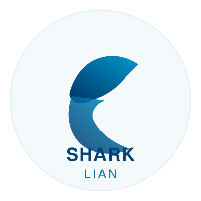

# NexRetail - SaaS 連鎖品牌管理系統

<div align="center">
  
  
  **Shark Lian Intelligence Dashboard**
  
  [](https://react.dev/)
  [](https://www.typescriptlang.org/)
  [](https://vite.dev/)
  [](https://tailwindcss.com/)
  [](https://ant.design/)
</div>

---

## 📖 專案簡介

NexRetail 是一個為連鎖服飾品牌設計的 SaaS 管理系統，包含完整的管理後台 (Dashboard) 與電商前台 (Shop) 功能。

## ✨ 功能特色

| 模組              | 功能                             |
| ----------------- | -------------------------------- |
| 🏠 **入口頁面**   | 模式選擇（顧客/管理者）          |
| 🛒 **電商前台**   | 商品列表、詳情、購物車、結帳     |
| 📊 **戰情室**     | KPI 卡片、銷售趨勢圖、熱銷排行   |
| 📦 **商品管理**   | SKU 變體管理、批次操作、庫存狀態 |
| 📈 **銷售分析**   | 熱銷排行榜、週銷售熱度圖         |
| ⚙️ **系統設定**   | 使用者權限管理、系統設定         |
| 📱 **RWD 響應式** | 手機/桌面雙版本自動切換          |
| 🌍 **多語言**     | 繁體中文 / English               |
| 🌙 **主題切換**   | 淺色/深色模式                    |

## 🛠️ 技術棧

- **Framework**: React 18 + TypeScript
- **Build Tool**: Vite 6
- **Styling**: Tailwind CSS 4 + Ant Design 5
- **State Management**: Redux Toolkit + React Query
- **Routing**: React Router 7
- **i18n**: react-i18next
- **Charts**: Recharts

## 🚀 快速開始

```bash
# 安裝依賴
npm install

# 開發模式
npm run dev

# 打包生產版本
npm run build
```

## 📂 專案結構

```
src/
├── components/        # 共用元件
│   ├── common/       # 通用元件 (KpiCard, etc.)
│   ├── layout/       # 佈局元件 (MainLayout, Sidebar, Header)
│   └── shop/         # 電商佈局
├── features/         # 功能模組
│   ├── dashboard/    # 戰情室
│   ├── products/     # 商品管理
│   ├── analytics/    # 銷售分析
│   ├── settings/     # 系統設定
│   ├── shop/         # 電商前台
│   └── entry/        # 入口頁面
├── store/            # Redux Store
├── hooks/            # 自訂 Hooks
├── i18n/             # 多語言配置
├── mocks/            # Mock API & Data
└── types/            # TypeScript 型別
```

## 🔗 路由

| 路徑                | 說明           |
| ------------------- | -------------- |
| `/`                 | 入口頁面       |
| `/shop`             | 電商商品列表   |
| `/shop/product/:id` | 商品詳情       |
| `/shop/cart`        | 購物車         |
| `/shop/checkout`    | 結帳           |
| `/admin`            | 管理後台戰情室 |
| `/admin/products`   | 商品管理       |
| `/admin/analytics`  | 銷售分析       |
| `/admin/settings`   | 系統設定       |

## 📄 License

MIT License

---

<div align="center">
  <sub>Built with ❤️ by <a href="https://sharklian-portfolio.vercel.app/">SharkLian Studio</a></sub>
</div>
